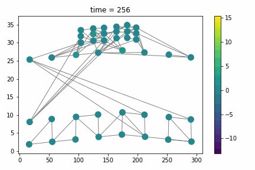
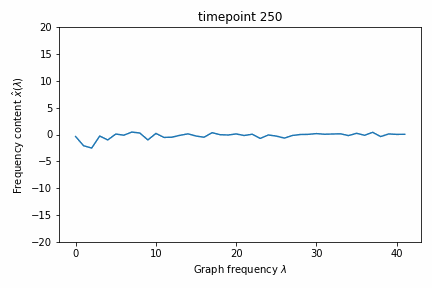

# Graph Signal Processing on Complex Networks for Structural Health Monitoring
Additional material for the paper. [PAGE IN PROGRESS]

## Abstract
In this work, we demonstrate the application of a framework targeting Complex Networks and Graph Signal Processing (GSP) for Structural Health Monitoring (SHM). 
By modeling and analyzing a large bridge equipped with strain and vibration sensors, we show that GSP is capable of selecting the most important sensors, investigating different optimization techniques for selection. Furthermore, GSP enables the detection of graph signal patterns (mode shapes), grasping the physical function of the sensors in the network. 
Our results indicate the efficacy of GSP on complex sensor data modeled in complex networks.

## Contributions

### 1. We propose the modeling options taken for making the real-world dataset applicable for GSP using a complex network representation.
Traditional signal processing can be extremely powerful in uniform, euclidean domains such as sampled audio or power circuits. 
However, not all domains have such a desirable property. 
For example, when the data at hand are sensors placed along specific locations in a building, the topography will most likely not resemble a uniform square grid. 
Specifically, there could be walls that influence the positions of sensors at each floor (and strength of the signal), or there could be floors without any sensors at all. 
Thus, the complexity of such networks implies that the data coming from irregular and complex structures do not lend themselves for standard tools.
This motivates more complex modeling, e.g., by including spatial dimensions, leading towards GSP; it extends Signal Processing by including irregular structures modeled as Graphs. Intuitively, signal data on a graph can then be visualized as a finite set of samples, with samples assigned to each node of the graph.

### 2. We present comprehensive analysis results, regarding sensor network modeling in a resource-aware way, aiming towards a minimal set of sensors for reconstructing the given signal
A fundamental task in GSP is to infer the values of certain sensors by interpolating them from a sample, e.g., when the application requires cost constraints that limit the number of nodes that can be observed, or when it would be too costly to sample at a high rate, so that values have to be inferred from a sample. Furthermore, the sensor selection could be used to increase the lifetime of battery-powered sensor networks, e.g., by calculating two optimal sets of sensors to turn on and of interchangeably.

### 3. We provide modeling results on signal pattern and event identification

In the following animation, the increased strain in the bridge is visible in the lower right part of the bridge. We also see a decrease in strain in the top part of the bridge, where the road is placed. Techniques to monitor the strain-behavior of the bridge gives insights that could help with condition-monitoring the structure.

One could also investigate the Fourier components of the exact same signal, visible in the following animation:

The vibration signal of the exact same moment during the traffic event, showing a back-and-forth vibration signal flowing through the concrete structure:

